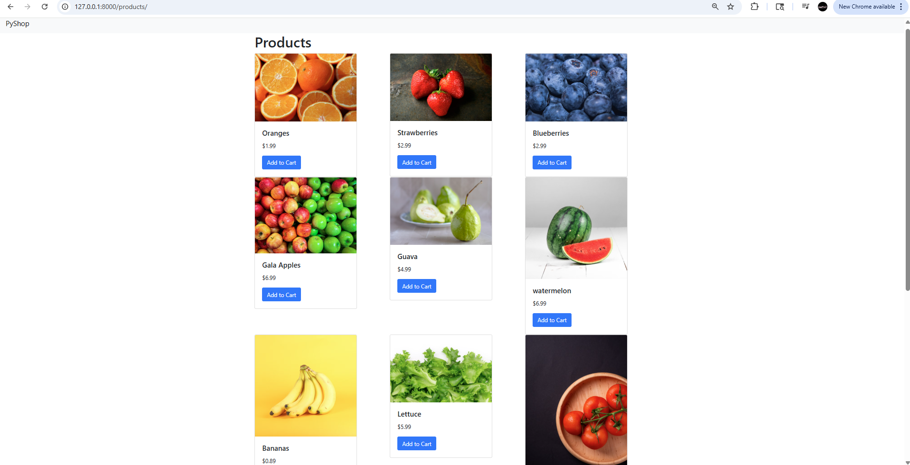

# 🍓 FruitMart - A Simple E-commerce Site with Django

FruitMart is a beginner-friendly e-commerce web application built with **Django** (Python), **HTML**, and **Bootstrap**.  
It demonstrates how to set up a Django project, create models, render data dynamically, and build a responsive UI.



---

## 🚀 Features
- Product listing with name, price, stock, and image
- Bootstrap-powered responsive design
- Admin panel for adding/editing products
- Dynamic template rendering using Django’s template engine

---

## 🛠️ Tech Stack
- **Backend:** Django (Python)
- **Frontend:** HTML, CSS, Bootstrap
- **Database:** SQLite (default Django DB)
- **Version Control:** Git + GitHub

---

## 📂 Project Structure
```
│── config
│── products/ # Products app (models, views, urls)
│── templates/ # HTML templates
│── db.sqlite3 # SQLite database
│── manage.py # Django project manager
│── requirements.txt # Dependencies
│── README.md # Project documentation
```


---

## ⚙️ Setup Instructions

### 1. Clone the Repository
```bash
git clone https://github.com/smantha28/FruitMart.git
cd fruitmart
```
### 2. Create Virtual Environment
```
python -m venv venv
```
### Activate it
- **Windows (PowerShell)** → `.\venv\Scripts\Activate`  
- **Mac/Linux** → `source venv/bin/activate`


### 3. Install Dependencies
```
pip install -r requirements.txt
```
### 4. Run Migrations
```
python manage.py migrate
```
### 5. Create Superuser (for admin panel)
```
python manage.py createsuperuser
```
### 6. Run the Development Server
```
python manage.py runserver
```
### 7. By default, the app runs on:
👉 http://127.0.0.1:8000/products  


